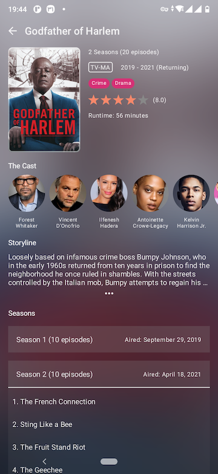

# Vikki

A Social platform for Movie lovers


## Technologies:
- Written in Kotlin
- UI written in [Jetpack Compose](https://developer.android.com/jetpack/compose)
- MVVM Architecture
- [Hilt](https://developer.android.com/training/dependency-injection/hilt-android) for Dependency Injection
- Uses [Navigation Component](https://developer.android.com/jetpack/compose/navigation)
- Uses [Coil](https://coil-kt.github.io/coil/compose/) for Image loading
- Uses [TMDb API](https://developers.themoviedb.org/) (via [TMDb-Kotlin](https://github.com/vkay94/TMDb-Kotlin) library)

## Development Setup
Because **Vikki** is written in Jetpack Compose, you need the latest version of [Android Studio](https://developer.android.com/studio) to be able to build it.

### API Key
**Vikki** uses [TMDb API](https://developers.themoviedb.org/), so you need to get an `API Key` from TMDb.
then, create a file named `secrets.properties`:

```
cp secrets.defaults.properties secrets.properties
```

put your API Key in that file:

```
# This file contains Secrets such as API Keys
# This file should *NOT* be checked into Version Control Systems
TMDB_API_KEY=YOUR_API_KEY
```

## Screenshots




